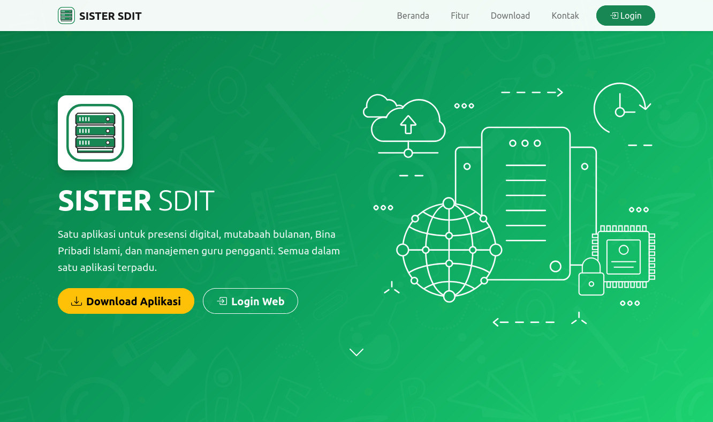
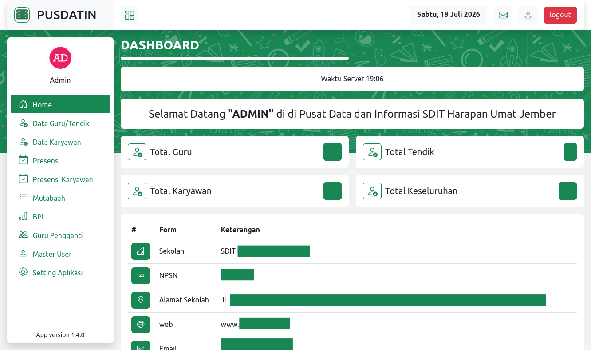
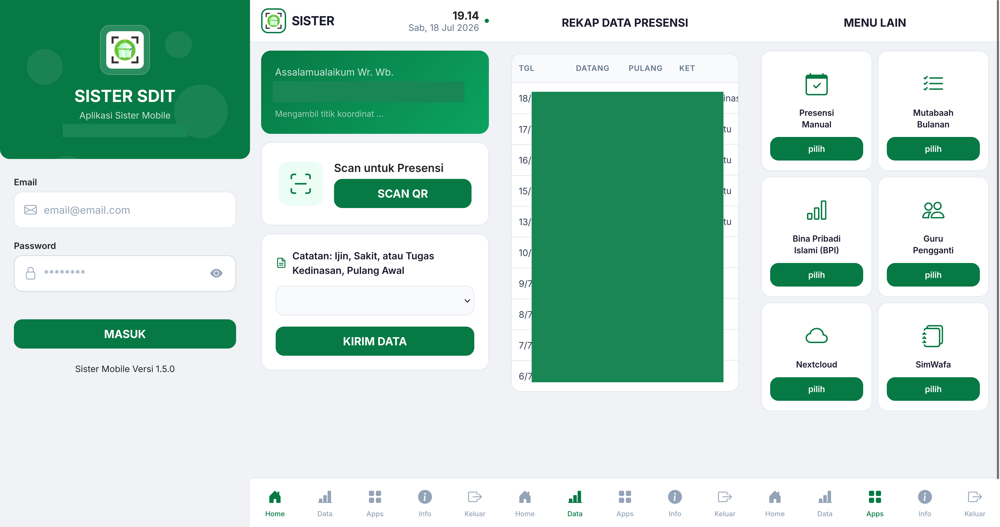

<p align="center">
  <h1 align="center">SISTER — Sistem Informasi Terpadu</h1>
  <p align="center">
    <strong>Sistem informasi terpadu untuk pengelolaan sekolah dasar Islam terpadu</strong>
  </p>
  <p align="center">
    
    
    
    
    
    
  </p>
</p>

---

## Preview

<p align="center">
  
</p>
<p align="center">
  
</p>
<p align="center">
  
</p>

---

## Tentang

**SISTER** (Sistem Informasi Terpadu) adalah aplikasi web dan mobile yang dirancang untuk mendukung operasional harian sekolah dasar Islam terpadu. Sistem ini mencakup manajemen presensi, Pembiasaan harian (mutabaah), pengelolaan data guru, serta berbagai fitur pendukung lainnya.

---

## Fitur Utama

### Web Application

| Modul                 | Deskripsi                                                        |
| --------------------- | ---------------------------------------------------------------- |
| **Presensi Guru**     | Pencatatan kehadiran guru harian, bulk input, export, dan filter |
| **Presensi Karyawan** | Pencatatan kehadiran guru dan tenaga kependidikan                |
| **Mutabaah**          | Pembiasaan harian berbasis kategori & pertanyaan                 |
| **BPI**               | Bina Pribadi Islami guru                                         |
| **Guru Pengganti**    | Manajemen penggantian guru dan penugasan                         |
| **Data Guru**         | Profil, pendidikan, pelatihan, dan data keluarga guru            |
| **Dokumen**           | Manajemen dokumen sekolah                                        |
| **Pengaturan**        | Konfigurasi sekolah, backup/restore database                     |
| **Manajemen User**    | User management berbasis role (Spatie Permission)                |

### Mobile Application

| Fitur                   | Deskripsi                                   |
| ----------------------- | ------------------------------------------- |
| **Login & Autentikasi** | Autentikasi via Sanctum token               |
| **Presensi QR Scan**    | Scan QR code untuk presensi                 |
| **Presensi Manual**     | Input presensi manual dengan verifikasi GPS |
| **Mutabaah**            | Input dan lihat data mutabaah               |
| **BPI**                 | Input dan lihat data BPI                    |
| **Guru Pengganti**      | Input dan lihat jadwal guru pengganti       |

---

## Tech Stack

### Backend

- **Framework**: Laravel 11
- **PHP**: 8.2+
- **Database**: MySQL 8.x
- **Authentication**: Laravel Sanctum (token-based API)
- **Authorization**: Spatie Laravel Permission
- **Export**: Maatwebsite Excel

### Frontend (Web)

- **Templating**: Blade
- **CSS Framework**: Bootstrap 5
- **JavaScript**: Vite

### Mobile App

- **Framework**: Vue 3 + Vue Router
- **CSS Framework**: Bootstrap 5 + Bootstrap Icons
- **Build Tool**: Vite
- **Platform**: Cordova (Android/iOS)

---

## Struktur Projek

```
sister/
├── app/
│   ├── Console/
│   ├── Exports/              # Excel export classes
│   ├── Http/
│   │   ├── Controllers/
│   │   │   ├── Api/          # API controllers (mobile)
│   │   │   ├── Bpi/
│   │   │   ├── Finance/
│   │   │   ├── Mutabaah/
│   │   │   ├── Presence/
│   │   │   ├── Replacement/
│   │   │   ├── Setting/
│   │   │   ├── Student/
│   │   │   └── Teacher/
│   │   ├── Middleware/
│   │   └── Resources/
│   ├── Imports/              # Excel import classes
│   └── Models/               # 24 Eloquent models
├── database/
│   ├── migrations/           # 29 migration files
│   └── seeders/
├── docs/                     # Dokumentasi & preview
├── public/
│   ├── github/               # Gambar untuk README
│   ├── apk/                  # APK mobile app
│   └── assets/               # Asset publik
├── resources/
│   └── views/                # Blade templates (16 modul)
├── routes/
│   ├── web.php               # Web routes (role-based)
│   └── api.php               # API routes (Sanctum)
├── sister_sdit_mobile/       # Vue 3 mobile app (Cordova)
│   └── src/
│       ├── components/
│       ├── composables/
│       ├── pages/
│       └── router/
└── tests/
```

---

## Role & Akses

| Role         | Akses                                                                 |
| ------------ | --------------------------------------------------------------------- |
| **Admin**    | Full access: user management, guru, siswa, setting, backup            |
| **Operator** | Presensi, mutabaah, BPI, guru pengganti                               |
| **Guru**     | Profil, data pribadi, presensi, mutabaah jawaban, BPI, guru pengganti |
| **Tendik**   | Profil, data pribadi, presensi, BPI                                   |
| **Karyawan** | Profil, data pribadi, presensi                                        |

---

## Routes

### Web Routes

```php
// Landing page (guest)
/                           → Landing page

// Auth
login, register             → Laravel Auth

// Admin (role:admin)
admin/user                  → User management
admin/school                → School settings
admin/teacher               → Teacher data
admin/karyawan              → Employee data
admin/setting               → Application settings
admin/setting/backup        → Database backup & restore

// Operator (role:admin|operator)
operator/presence           → Teacher presence
operator/presencekaryawan   → Employee presence
operator/mutabaah           → Mutabaah management
operator/bpi                → BPI management
operator/replacement        → Teacher replacement

// Guru (role:guru|tendik|karyawan)
guru/teacher-profile        → Teacher profile
guru/teacher-presence       → View presence
guru/education              → Education data
guru/child                  → Children data
guru/training               → Training data
guru/answer                 → Mutabaah answers
guru/bpi                    → BPI management
guru/replacement            → Replacement management
```

### API Routes (Mobile)

```php
// Public
POST /api/login             → Mobile login

// Protected (Sanctum)
GET  /api/verify-token      → Verify token
GET  /api/settinglist       → Get settings
CRUD /api/presence          → Presence CRUD
CRUD /api/presencekaryawan  → Employee presence CRUD
POST /api/logout            → Logout
```

---

## Setup & Installation

### Prerequisites

- PHP 8.2+
- Composer
- Node.js 18+
- MySQL 8.x
- XAMPP / Laravel Herd / Docker

### Backend Setup

```bash
# Clone repository
git clone <repository-url>
cd sister

# Install dependencies
composer install

# Copy environment file
cp .env.example .env

# Generate application key
php artisan key:generate

# Configure database in .env
DB_DATABASE=sister
DB_USERNAME=root
DB_PASSWORD=

# Run migrations & seeders
php artisan migrate --seed

# Storage link
php artisan storage:link

# Start development server
php artisan serve
```

### Mobile App Setup

```bash
cd sister_sdit_mobile

# Install dependencies
npm install

# Development
npm run dev

# Build for production
npm run build

# Build for Cordova
npm run cordova:build
```

---

## Database

Sistem menggunakan **29 tabel** dengan model utama:

- `users` — User authentication
- `teachers` — Data guru & karyawan
- `students` — Data siswa
- `student_parents` — Data orang tua siswa
- `presences` — Presensi siswa
- `presencekaryawans` — Presensi karyawan
- `presence_settings` — Pengaturan presensi
- `mutabaahs` — Data mutabaah
- `categories` — Kategori mutabaah
- `questions` — Pertanyaan mutabaah
- `options` — Opsi jawaban
- `answers` — Jawaban mutabaah
- `bpis` — Data BPI
- `replacements` — Guru pengganti
- `schools` — Data sekolah
- `settings` — Pengaturan aplikasi
- `documents` — Dokumen sekolah
- `entity_orders` — Urutan entitas guru

---

## License

Digunakan Khusus untuk Sekolah SDIT
